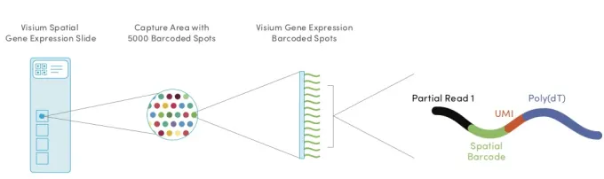
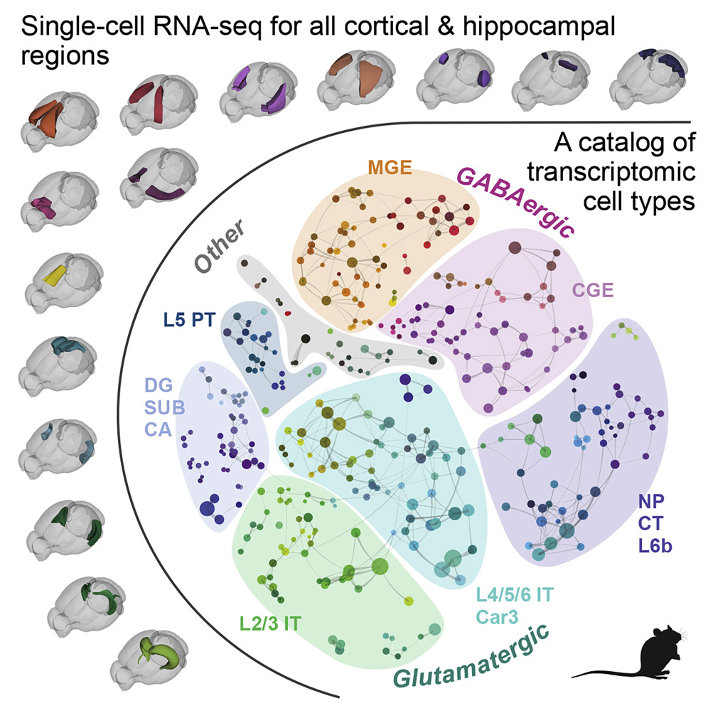
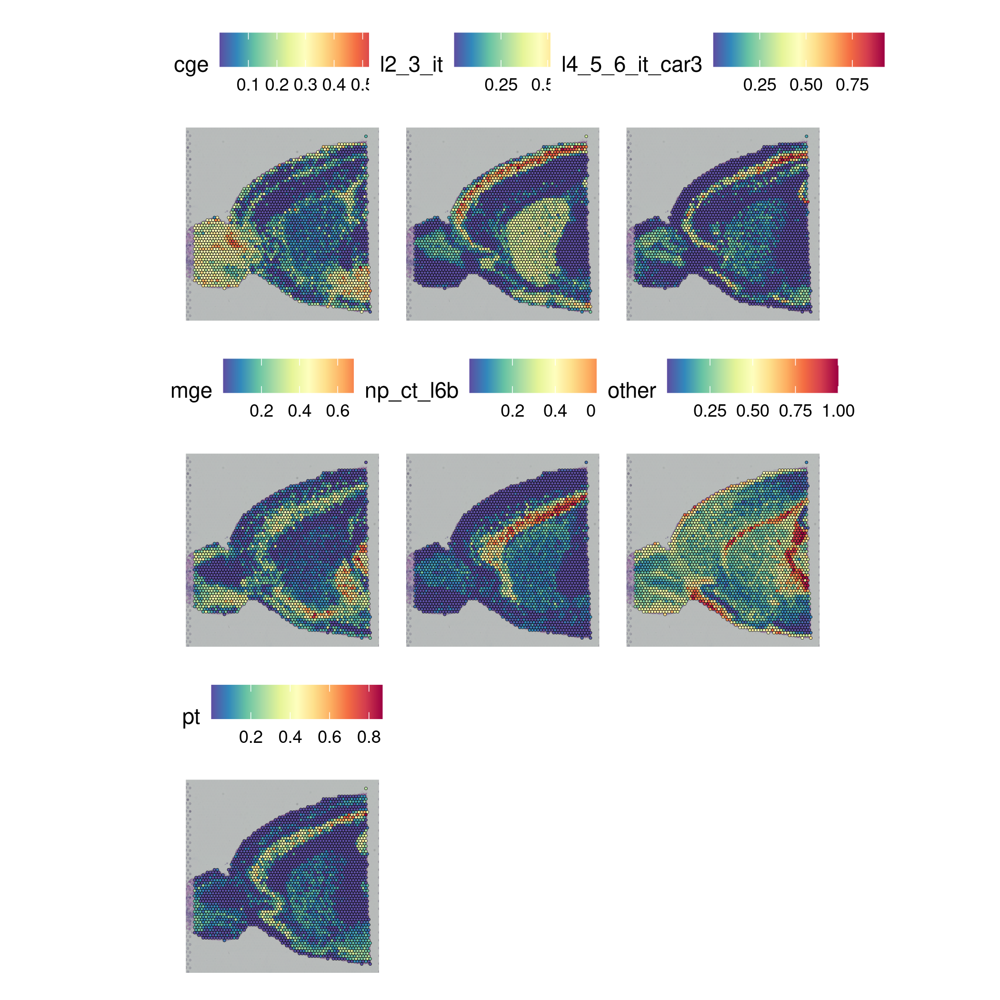
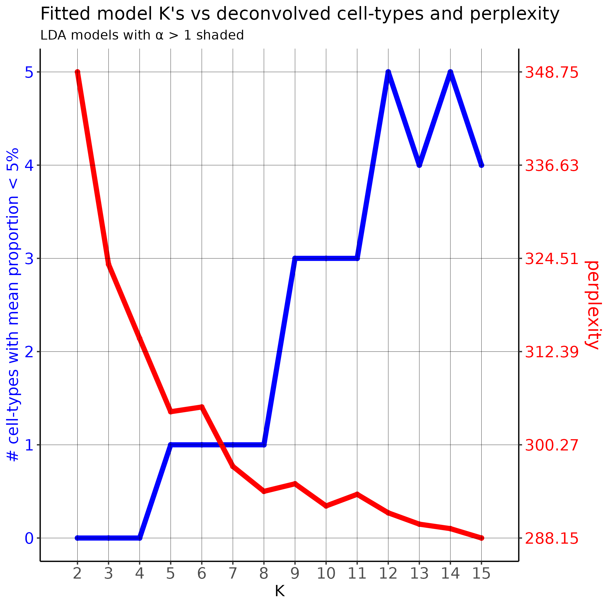

```{r setup, include=FALSE}
#option
options(width = 300)

knitr::opts_chunk$set(
  fig.width = 7, fig.height = 5, 
  fig.align = "center", 
  size = "tiny", 
  echo = FALSE, eval = TRUE, 
  warning = FALSE, message = FALSE, 
  results = TRUE, comment = "")
options(scipen = 12) ## Max number of digits for non-scientific notation
```

\pagenumbering{gobble} 

\centering
\vspace{1cm}
\LARGE  Projet Long \linebreak
\vspace{1cm}
\Large Paul Etheimer \linebreak
\vspace{0.5cm}
\Large 4 Juin 2023 \linebreak
\vspace{1cm}

\huge \textbf {Rapport sur la déconvolution single-cell}

\vspace{5cm}
\centerline{\includegraphics[height=1in]{university.png}}
\vspace{6cm}
\large UFR Science de la Vie \linebreak
\normalsize M2 Biologie Informatique \linebreak
\normalsize  2022-2023 \linebreak


\raggedright


\pagenumbering{arabic} 


&nbsp;

\pagebreak

```{r libraries}
library(ggplot2)
library(readr)
library(dplyr)
library(janitor)
library(tibble)
```

```{css, echo=FALSE}
div.figure {
  display: block;
  text-align: center;
}
p.caption {
  font-size: 0.8em;
}

```

# Introduction

La technologie Visium de 10x Genomics est une des deux technologies majeures pour étudier l'expression des gènes dans leur contexte spatial. Historiquement, beaucoup [@mosesMuseumSpatialTranscriptomics2022] font débuter la transcriptomique spatiale à la fin des années 1990 avec l'apparition du smFISH. Deux grandes approches subsistent aujourd'hui, l'une basée sur la microscopie optique via la fluorescence, et la seconde basée sur le séquençage nouvelle génération (Next Generation Sequencing (NGS)) via le barcoding spatial. La plateforme Genom'IC a fait le choix de la seconde, de manière logique puisqu'elle se spécialise dans la transcriptomique NGS, et a choisi la technologie Visium (plutôt que sa concurrente, Slide-Seq) de 10x, ayant déjà une bonne expérience dans la technologie single-cell commercialisée par cette entreprise.

Toutes les approches actuelles, basées sur la microscopie comme sur le NGS, résultent de compromis entre la largeur de détection (avec ou sans *a priori*), la résolution (qui peut aller jusqu'à la cellule unique), l'efficacité de détection et la surface du tissu (ces deux dernières étant généralement opposées), et enfin la facilité d'utilisation et la compatibilité avec certaines méthodes de conservation de tissus (toutes fonctionnent sur des tissus congelés, mais seule la technologie Visium peut utiliser le FFPE). La technologie Visium est aujourd'hui la plus employée [@mosesMuseumSpatialTranscriptomics2022]. Elle n'a pas d'a priori (ne fonctionne pas via un panel de gène pré-déterminé), ce qui se paye par un relativement faible nombre de gène détecté (efficacité de détection de 6 à 15%), ainsi qu'une résolution assez faible. En effet, la lame sur laquelle est placé le tissu est divisée en spots de 55µm de rayon, ce qui excède nettement la taille moyenne d'une cellule. En fonction du tissu, il est généralement accepté qu'il y a entre 5 et 10 cellules par spot. Chaque spot de capture est quadrillé par des fragments d'ARN ancrés, qui possèdent entre autre une queue poly(dT), qui permet de capturer les ARNm polyA complémentaires, ainsi qu'un code unique par spot (spatial barcode). Après séquençage, il est donc possible de retrouver de quel spot provient quel read. L'information au niveau cellulaire n'est donc pas capturée.



La déconvolution single-cell est une tentative de remédier à cette limitation de la résolution du Visium. Chaque spot peut en effet être considéré comme un mélange potentiellement hétérogène de transcriptomes provenant de différentes cellules, et le but de la déconvolution est donc de définir quelle somme pondérée de différent signaux (transcriptomes) permet d'aboutir au mélange constaté. La plupart des méthodes développées pour répondre à cette question se basent sur une référence, c'est à dire un jeu de donnée single-cell annoté (i.e. affectant des types cellulaires aux cellules d'un jeu de données single-cell) pour découvrir lesquels de ces types cellulaires contribuent à quels spots. C'est un champ de recherche extrêmement actif, avec un nombre très important de méthodes développées dans les dernières années, et de tentatives de les comparer et classer (@liBenchmarkingSpatialSinglecell2022 , @chenComprehensiveComparisonCelltype2022 , @liComprehensiveBenchmarkingPractical2023). De nombreuses approches méthodologiques ont été proposées, probabilistes fréquentistes (par Maximum Likelihood Estimation (MLE)) telles RCTD [@cableRobustDecompositionCell2022], bayésienne variationnelle telle que cell2location [@kleshchevnikovCell2locationMapsFinegrained2022], bayésienne (par estimation du Maximum A Posteriori (MAP)) comme stereoscope [@anderssonSinglecellSpatialTranscriptomics2020], une variation des moindres carrés (dampened weighted least squares) spatialDWLS [@dongSpatialDWLSAccurateDeconvolution2021], une approche Deep Learning nommée Tangram [@biancalaniDeepLearningAlignment2021], une implémentation d'un *shortest augmenting path optimization algorithm* CytoSPACE [@vahidHighresolutionAlignmentSinglecell2023], ou encore une approche auto-supervisée basée sur les *graph neural networks* GraphST [@longSpatiallyInformedClustering2023]. Nous avons également identifié une méthode ne nécessitant pas de référence single-cell annotée, STdeconvolve [@millerReferencefreeCellType2022], basée sur l'allocation latente de Dirichlet (fréquemment utilisée en *text mining*). Cette liste de méthodes publiées dans les meilleurs journaux est non exhaustive, mais elle montre qu'il peut-être difficile, voire impossible, de distinguer une méthode supérieure aux autres dans tous les cas, sachant que même les dernières publiées ne se comparent pas à l'intégralité de leurs concurrents. En effet, pour par exemple Tangram et GraphST, la déconvolution single-cell n'est qu'une des possibilité offerte par l'outil (et n'est pas l'unique focus de leur article), tandis que d'autres sont sorties au début de l'explosion du domaine, comme spatialDWLS et stereoscope. Les trois benchmarks précédemment cités peuvent servir de guides, mais ils souffrent également de quelques limitations : tout d'abord, en fonction de leur date de publication, ils ne comparent pas tous les outils du domaine. Mais plus important encore, il n'existe pas de *ground truth*, c'est à dire de jeu de données à la résolution cellulaire, sans *a priori* (sans panel de gène), et de la même surface de tissu que la technologie Visium. Les auteurs de ces articles utilisent donc deux types de jeux de données : des jeux de données sur un nombre réduit de cellules avec panel de gène, dont la résolution est réduite (des cellules sont mélangées en spots). Il s'agit alors pour les outils de déconvolution de retrouver quelles cellules ont été mélangées. Le second type consiste en des jeux de données simulés, mais sans certitude absolue quand à leur ressemblance à un jeu de données réels, ou sur le fait qu'ils puissent favoriser un outil par rapport à un autre.


Yoann Martin est le spécialiste transcriptomique spatiale à la plateforme Genom'IC de l'Institut Cochin, et est également intégré à l'équipe d'Éric Pasmant travaillant sur la génétique et l'épigénétique des tumeurs rares. Dans le cadre d'un projet comportant une partie transcriptomique spatiale sur une tumeur rare, il a été amené à utiliser le programme stereoscope, dont l'évaluation dans ce cas particulier est encore en cours. S'il semble pour l'heure prometteur en terme de résultats, stereoscope l'est bien moins en terme de temps de calcul. En effet, sa dernière utilisation (sur CPU) a pris plus de deux semaines pour obtenir des résultats, avec il est vrai une référence conséquente (70k cellules). Ce projet consiste donc en l'évaluation sommaire de quelques-unes des méthodes précédemment citées. Sommaire, car une évaluation complète rentrerait plutôt dans le cadre d'un article pour Nature methods que d'un projet long, et de seulement quelques unes de ces méthodes car toutes ne s'intègrent pas facilement dans le pipeline actuel de la plateforme, qui utilise Seurat, tandis que certains outils utilisent scanpy/squidpy. Ces deux super-packages définissent un workflow et des structures de données pour l'analyse single-cell et transcriptomique spatiale, et il est difficile de maintenir les deux alternatives à la plateforme, outre qu'ils soient tout deux difficiles d'approche pour un débutant. Enfin, les algorithmes et les jeux de données ciblés sont extrêmement lourds, mais étant donné l'absence de GPU disponible sur la plateforme pour l'instant, j'ai utilisé mon PC personnel (i9-12900K, RTX 3070, 32GB RAM) pour les calculs, ce qui a constitué une limite certaine (particulièrement en terme de RAM).

Le but de ce projet est donc de défricher le champ de la déconvolution single-cell, afin de proposer une alternative à stereoscope qui soit plus efficace et plus précise. Dans le cadre du projet scientifique sur la glande surrénale sur lequel travaille actuellement Yoann Martin, le temps trop important pris par stereoscope a pour effet d'empêcher l'itération rapide, et en particulier de pouvoir évaluer l'impact de l'évolution de l'annotation du jeu de données single-cell sur la déconvolution. Cette exploration a également pour but d'évaluer l'intérêt d'augmenter les ressources de la plateforme en calcul GPU : en effet nombre de ces outils (cell2location, tangram, stereoscope...) bénéficie de façon importante du fait d'effectuer leurs calculs sur GPU, et un choix pour l'une de ces méthodes aura un impact sur les décisions d'équipement futur.

Les différents benchmarks consultés nous ont permis de sélectionner deux méthodes qui paraissent adaptées : RCTD, qui semble être une méthode proche de stereoscope (utilisant une modélisation proche, mais plus simple), est écrite en R (ce qui est plus simple à intégrer pour mes collègues), et est classée favorablement, et cell2location, qui permet d'évaluer des abondances cellulaires, en plus des proportions, semble plus efficace computationnellement tout en restant très bien considéré par les benchmarks précédemment cités. En outre, cell2location est développé au Wellcome Sanger Institute, semble déjà beaucoup cité, est intégré à la librairie scvi-tools, et fait l'objet d'un support continu, ce qui est prometteur. Ces deux méthodes permettent de remplacer directement stereoscope, pour déconvoluer une lame de Visium à partir d'un jeu de données single-cell annoté. Mais comme mentionné précédemment, il existe aussi d'autres méthodes utilisant uniquement la lame de Visium pour réaliser cette déconvolution, comme STdeconvolve [@millerReferencefreeCellType2022]. Nous avons décidé d'inclure cette méthode, car elle permet d'ajouter un point de comparaison sans données supervisées.


# Matériel et méthodes

Pour évaluer les algorithmes retenus, nos encadrants ont sélectionné deux jeux de données. Le premier est un jeu de données single-cell de référence, annoté. Il s'agit du  *Whole cortex & hippocamus - 10X* murin du Allen Institute for Brain Science et sa taxonomie [@yaoTaxonomyTranscriptomicCell2021]. Le second, un jeu de données Visium fourni par 10x disponible [ici](https://www.10xgenomics.com/resources/datasets/mouse-brain-serial-section-2-sagittal-anterior-1-standard), est une coupe de tissu congelé issu du cerveau d'une souris mâle adulte, possédant plus de 2800 spots occupés. Le jeu de données single-cell comporte 54 individus pour un total de plus de 1,1 million de cellules, et la sélection de ces cellules est réalisée de sorte à enrichir le jeu de donné final en neurones. Ce jeu de données, qui au format csv représente le double de la RAM disponible, a été ramené à un seul individu, comportant 20 581 cellules. Ceci est plus proche du fonctionnement normal des algorithmes testés et à l'utilisation qu'il en sera faite par l'équipe d'Éric Pasmant et la plateforme. Les catégories de types cellulaires (*"neighborhoods"*) identifiés par [@yaoTaxonomyTranscriptomicCell2021], au nombre de 8, ne sont pas présentes en proportions équivalentes selon les individus, ce qui est attendu.

Ces catégories sont issues de l'article d'où proviennent les données single cell [@yaoTaxonomyTranscriptomicCell2021], et sont consituées de 2 types de neurones GABAergic (MGE et CGE), 5 glutamatergiques (L2/3 IT, L4/5/6 IT Car3, PT, NP/CT/L6b, et DG/SUB/CA, ce dernier n'étant pas présent dans l'individu sélectionné), et une catégorie "Other". Cette dernière catégorie rassemble l'ensemble des cellules gliales (astrocytes, oligodendrocytes, cellules de Schwann, épendymocytes et microglie), qui représentent autour de 50% des cellules dans un cerveau murin [@vonbartheldSearchTrueNumbers2016]. Elle est donc fortement hétérogène, présente de manière importante dans le jeu de données de transcriptomique spatiale, mais n'est représentée que par peu de cellules dans le jeu de données de référence, ce qui sera un challenge important pour les algorithmes testés.

{width=50%}

```{r, fig.cap="Distribution des types cellulaires dans la souris sélectionnée", out.width="50%"}

props <- read_delim("~/data/sc_mousebrain_allen/sc_allen/nb_tax.tsv", delim = " ")
ggplot(props, aes(x = bio_celltype, y = count)) +
  geom_bar(stat = "identity")
```


## Stereoscope

Stereoscope est la méthode actuellement employée par mon encadrant. Bien classé par un des benchmarks consultés [@chenComprehensiveComparisonCelltype2022], stereoscope utilise une distribution binomiale négative (Gamma-Poisson) pour modéliser la distribution des comptes des gènes des spots et des cellules. C'est la modélisation classique en bulk RNA-Seq, qui contrairement à la distribution Poisson utilisée par RCTD notamment, rend compte de l'hétéroscédasticité de ce type de distribution (forte variance pour les fortes moyennes). L'estimation des paramètres (notamment la distribution des types cellulaires) est réalisée par Maximum A Posteriori. Les résultats sont une estimation de la proportion de chaque type cellulaire à chaque spot, ce qui est différent de RCTD en full mode, qui donne uniquement un score (qui ne somme pas à un). 

Son défaut le plus important est le temps nécessaire à l'exécution, nous avons pu observer plus de deux semaines sur 8 cœurs et pour une jeu de données de référence de 70k cellules, sur GPU et 20k cellules cette durée est ramenée à près de 19h, ce qui est assez important. Stereoscope utilise torch pour l'optimisation, et permet de traiter les données en mini-batchs. Le nombre d'époques est très important par défaut (75 000) et la taille des mini-batchs, single cell comme spatial, est très faible (100). Ceci a pour effet que la performance est assez peu affectée par le nombre de cœurs alloués à l'outil, qui ne semble pas vraiment les utiliser à 100%. Pour mes essais sur GPU, la taille des batchs a été augmentée à 5000, sans utiliser pour autant une forte quantité de VRAM (~1,2GB). 


## RCTD
RCTD (Robust Cell Type Deconvolution), un algorithme initialement conçu pour la technologie concurrente Slide-Seq, considère que la distribution des comptes en chaque spot suit un mélange Poisson-log normal. C'est donc un algorithme probabiliste, dont l'estimation des paramètres repose sur le maximum de vraisemblance. Il fonctionne en plusieurs étapes, en commençant par estimer les profils des types cellulaires, calculant l'expression moyenne des gènes dans ceux-ci. Puis seuls les gènes informatifs sont filtrés, avant une étape de normalisation des biais entre les plateformes (entre le Visium et le single cell, dans notre cas). Enfin, l'estimation est calculée afin d'obtenir les poids des types cellulaires dans la combinaison linéaires de ceux-ci à chaque spot. Le temps de calcul est assez important, autour d'une demi-journée sur 16 threads, avec une forte occupation de la RAM. 

Par défaut, RCTD considère qu'il ne peut y avoir que deux types cellulaires par spot ("doublet-mode"), ce qui est le plus probable en Slide-Seq. Ici nous utilisons le mode "full", qui donne un poids à chaque type cellulaire du jeu de données de référence.


## Cell2location

Cell2location est également une méthode probabiliste bayésienne, qui utilise l'inférence variationnelle bayésienne pour déconvoluer les types cellulaires présents dans les différents spots. À ce titre, cette méthode possède deux hyperparamètres (priors), le premier sur le nombre de cellules par spot attendu, avec une valeur par défaut de 5, ce qui correspond à la valeur attendue pour la technologie Visium, le second prior étant sur la variabilité de détection d'ARN par spot, par défaut à 20 (ce que nous avons également utilisé). La première partie de l'algorithme, pour déterminer la signature des différents types cellulaires, utilise une régression binomiale négative, comme stereoscope. La seconde partie utilise ces signatures pour décomposer les comptages de RNA dans chaque localisation en types du jeu de données de référence, en utilisant l'inférence variationnelle approximative. Il est à noter que comme la publication de cell2location est postérieure aux deux précédents outils cités, ses auteurs peuvent les comparer. Cette comparaison, qui montre une supériorité de cette méthode, est en accord avec les résultats du benchmark publié dans Nature Methods [@liBenchmarkingSpatialSinglecell2022]. 

<!-- whereas Monte Carlo techniques provide a numerical approximation to the exact posterior using a set of samples, variational Bayes provides a locally-optimal, exact analytical solution to an approximation of the posterior.Wikipedia  -->

Grâce à son prior sur le nombre de cellule par spot, cell2location permet d'estimer l'abondance de chaque type cellulaire en plus de leur proportion. En outre, son utilisation de l'accélération GPU permet de raccourcir nettement les temps de calcul, et ainsi d'itérer très rapidement. En effet, pour 30 000 époques sur notre jeu de données, les résultats peuvent être obtenus en moins d'une heure, en utilisant autour de 4GB de VRAM.

## STdeconvolve

Il n'est pas évident de classifier STdeconvolve comme strictement une méthode de déconvolution single-cell : en effet, il est difficile de délimiter précisément ce qui sépare cette méthode des méthodes de clusterisation utilisées dans Seurat par exemple (`RunPCA` -> `FindNeighbors` -> `FindClusters` -> `runUMAP`). Mais outre les limites de l'UMAP [@chariSpeciousArtSingleCell2022], STdeconvolve ne consiste pas seulement en du clustering, mais attribue des proportions de types cellulaires à chaque spot. Il ne s'agit alors pas uniquement de délimiter un nombre de zones tissulaires prédéfinies, mais de découvrir de quel mélange de type cellulaires les spots sont constitués. Pour ce faire, STdeconvolve utilise une méthode issue du *text mining*, l'allocation latente de Dirichlet [@bleiLatentDirichletAllocation2003]. Cette méthode, probabiliste bayésienne (également), modélise les objets d'une collection (documents d'un corpus par exemple), comme un mélange de sujets latents qui possèdent chacun une probabilité à évaluer. Ici, les sujets latents sont les types cellulaires, et les documents sont les spots. Les mots sont donc représentés par les gènes, dont les comptages sont approximativement une représentation *bag of words* d'un texte. L'estimation est réalisée par Espérance-Maximisation variationnelle. La principale limitation de cette méthode est de devoir définir un nombre de *topics* *a priori*, mais STdeconvolve dispose d'outils pour aider à faire ce choix : en particulier, le calcul de la perplexité (opposé de la log vraisemblance du jeu de donnée avec les paramètres estimés, divisé par la somme des comptages), qui indique la fidélité du modèle au jeu de données, qui diminue avec l'augmentation du nombre de *topics* et qui peut marquer un coude permettant de choisir ce K judicieusement d'une part, et d'autre part le nombre de type cellulaires avec une moyenne de présence dans les spots de moins de 5%, qui elle augmente avec le nombre de *topics*. Pour obtenir ces paramètres, il est nécessaire de réaliser l'estimation pour une gamme de valeurs de K, le nombre de *topics*. Malgré ces différents modèles à estimer, STdeconvolve est la méthode la plus frugale de celles testées, ne requérant qu'une dizaine de minutes pour estimer 14 modèles (en parallélisant les calculs sur 14 coeurs). 

L'avantage de STdeconvolve est de permettre une analyse similaire aux autres outils présentés dans ce rapport, sans nécessiter de disposer d'un jeu de données de référence qui corresponde précisément aux tissus pour lesquels on dispose de données de transcriptomique spatiale, ce qui est particulièrement avantageux lorsque l'on travaille sur des tissus dans le contexte de maladies parfois rares. Le désavantage logique est de ne pas disposer d'annotation pour chacun des *topics* identifiés, mais STdeconvolve intègre deux méthodes pour annoter les types cellulaires identifiés, l'un basé sur le fait de connaître des profils transcriptomiques de référence et de réaliser une analyse de corrélation. En effet, STdeconvolve fourni des profils transcriptomiques pour les *topics* identifiés. La seconde méthode est de réaliser un enrichissement via GSEA si l'on dispose de listes de gènes caractéristiques de types cellulaires attendus.


# Résultats

## Stereoscope

Sur nos jeux de données, stereoscope esquisse la répartition suivante :


Visuellement, on observe la succession de couches L2/L3/IT puis L4/L5/L6IT/CAR3 puis NP/CT/L6B, qui semble être une caractéristique de ce tissu. Le type "Other" des cellules gliales est présent dans beaucoup de zones du tissu, ce qui est attendu. Quand on observe la répartition du nombre de cellules de chaque type déconvolués par stereoscope, on remarque une quasi-majorité de cellules "Other", comme attendu.

```{r, fig.cap="Totaux des poids affectés à chaque type cellulaire, stereoscope", out.width="50%"}
stereo_w <- read_tsv("./stereoscope/results/st_stereo_rn/W.2023-05-08115234.822513.tsv") %>%
  clean_names() %>%
  column_to_rownames("x1")

colSums(stereo_w, na.rm = TRUE) %>%
  as.data.frame() %>%
  rownames_to_column("celltype") %>%
  rename("total_weights" = ".") %>%
  ggplot(aes(x = celltype, y = total_weights)) +
  geom_bar(stat = "identity")

```


## RCTD


Sur nos jeux de données nous obtenons la représentation suivante :


Visuellement, on observe que les structures connues sont reproduites, en particulier la succession des types cellulaires L2/L3, puis L4/5/6, puis L6b en couches. Il semble également qu'un nombre important de cellules aient été classés dans la catégorie "Other", ainsi que dans la catégorie "PT" (Pyramidal Tract, les neurones du faisceau pyramidal), ce qui est confirmé dans la figure suivante.

```{r, fig.cap="Totaux des poids affectés à chaque type cellulaire, RCTD", out.width="50%"}
weights_rctd <- read.csv("./rctd/rctd_weights.csv", row.names = 1) 
colSums(weights_rctd, na.rm = TRUE) %>%
  as.data.frame() %>%
  rownames_to_column("celltype") %>%
  rename("total_weights" = ".") %>%
  ggplot(aes(x = celltype, y = total_weights)) +
  geom_bar(stat = "identity")

```


Étant donné que les types PT et Other ne rassemblent qu'autour de 2,5% du jeu de données de référence, ces assignations identifiant 22% de neurones du faisceau pyramidal dans notre coupe de tissu sont à prendre avec précaution. La présence aussi importante du type neuronal glutamatergique PT est assez peu probable. Il semble que RCTD ait eu des difficultés à bien définir le type "PT" et le séparer du type "Other". Cela semble indiquer des difficultés de cette méthode à bien définir et déconvoluer des types cellulaires rares dans le jeu de données de référence, contrairement à stereoscope précédemment.


## Cell2location
Cell2location obtient la déconvolution suivante sur nos jeux de données : 


On observe une répartition des types cellulaires qui est très proche de celle de stereoscope, où l'on peut bien voir la succession des couches L2/L3 IT, L4/M5/L5 IT Car3 puis NP CT L6B. On note cependant que la seconde de ces couches est plus fine avec stereoscope que cell2location, et qu'en revanche un peu du bruit de fond (au centre de la coupe) de cette couche dans stereoscope semble avoir disparu dans cell2location. On note également une présence encore plus élevée du type "Other". Il est cependant difficile pour nous de distinguer laquelle de ces interprétations est la plus correcte, pour la première de ces différences tout du moins.

On note cette forte différence entre cell2location et stereoscope de manière plus flagrante sur la figure suivante. C'est maintenant l'écrasante majorité des spots de la coupe qui sont peuplés de cellules "Other". Ceci n'a toutefois pas perturbé outre mesure la représentation précédente, où les structures attendues de neurones glutamatergiques ont bien été retrouvé. Sans information précise sur les proportions attendues, il est difficile de trancher quant à la plus probable des deux répartitions entre cell2location et stereoscope. On remarque que selon cell2location, 42% des cellules de la coupe sont des neurones, tandis que pour stereoscope près de 70% d'entre elles sont des neurones. Comme indiqué précémment, le cerveau murin possède un nombre de cellule gliales et neuronales équivalent [@vonbartheldSearchTrueNumbers2016], mais ceci pourrait être différent dans la région considérée ici.

Il est intéressant de noter que d'après le benchmark [@liBenchmarkingSpatialSinglecell2022] on aurait pu attendre que les résultats soient inversés : en effet il y est mentionné que lorsqu'un type cellulaire est supprimé de la référence, cell2location a tendance à assigner les cellules qui y correspondent à tous les types cellulaires, tandis que stereoscope et RCTD les attribuent aux types cellulaires les plus proches. Ici en revanche, on observe que la répartition du type *"Other"* opérée par cell2location est bien plus tranchée que celle de stereoscope.

```{r, fig.cap="Totaux des poids affectés à chaque type cellulaire, cell2location", out.width="50%"}
cell2loc <- read_csv("./cell2loc/results/cell2location_map/abundance_matrix.csv") %>%
  column_to_rownames("sample_name")
colnames(cell2loc) <- make_clean_names(substring(colnames(cell2loc), 24))
# cell1loc <- t(apply(cell2loc, 1, function(x){x/sum(x)}))


colSums(cell2loc, na.rm = TRUE) %>%
  as.data.frame() %>%
  rownames_to_column("celltype") %>%
  rename("total_weights" = ".") %>%
  ggplot(aes(x = celltype, y = total_weights)) +
  geom_bar(stat = "identity")

```

## STdeconvolve

STdeconvolve requiert de fixer un nombre de type cellulaire a priori avant l'estimation des paramètres. En représentant la perplexité en fonction de ce nombre, on peut estimer graphiquement celui pour lequel on observe un coude dans la valeur de la perplexité.

{width=50%}


On observe que la perplexité semble marquer deux coudes, le premier à K=5 et le second à K=8. Nous retenons le second, plus marqué, et qui permet une comparaison plus aisée avec les autres algorithmes présentés ici.

La déconvolution obtenue par STdeconvolve, en utilisant un nombre de types attendus de 8, sur la coupe de cerveau murin est visible sur la figure suivante.


Sur cette figure on observe une nette différence entre les autres méthodes et STdeconvolve. Ce résultat est sens doute fortement lié à l'enrichissement massif en neurones du jeu de données single-cell, qui mélange ensemble tous les types de cellules gliales (au moins 50% du cerveau murin) sous la catégorie "Other". Cependant, celles-ci ne sont pas uniformes, et sont séparées prioritairement par STdeconvolve. Les trois couches de neurones glutamatergiques (L2/3 IT, L4/5/6 IT Car3, et NP/CT/L6b) sont réunies en deux couches uniquement. Différentes structures, qui étaient rassemblées dans le groupe "Other" sont ici séparées.


{width=80%}


En représentant 15 types cellulaires, on observe que des couches correspondant visuellement aux neurones glutamatergiques précedemment mentionnés semblent émerger (topic 4, 14 et 15). À cette résolution cependant, certains types (le topic 1 en particulier) semblent être des subdivisions trop fines de types plus larges.

STdeconvolve est ardu à comparer aux autres méthodes lorsque la référence utilisée par ces dernières est éloignée de la transcriptomique spatiale. Mais c'est également ce qui en fait la richesse, car elle peut permettre de caractériser cette distance.


## Distance entre les méthodes

En l'absence de vérité absolue sur la composition de la coupe de tissu, il est difficile d'établir laquelle des méthodes est la plus proche de la réalité. Cependant, il est toujours possible de représenter quelles sont les distances entre les différentes assignations de type cellulaire : si l'on considère que chaque spot est décrit par un vecteur de taille 7 (comme les 7 types cellulaires présent) normalisé préalablement, il est alors possible de calculer une distance comme le RMSD et d'observer quelles sont les méthodes dont les assignations sont le plus proche.

```{r}
cell2loc_norm <- t(apply(cell2loc, 1, function(x){x/sum(x)}))
stereo_w_norm <- t(apply(stereo_w, 1, function(x){x/sum(x)}))
weights_rctd_norm <- t(apply(weights_rctd, 1, function(x){x/sum(x)}))
list_df <- list("cell2location" = cell2loc_norm, "stereoscope" =  stereo_w_norm, "rctd" = weights_rctd_norm)

rmsd <- function(df1, df2) {
  mean(rowSums((df1 - df2)^2))^0.5
}

distance_mat <- matrix(0, nrow = length(list_df), ncol = length(list_df))
colnames(distance_mat) <- names(list_df)
rownames(distance_mat) <- names(list_df)
for (row in seq_len(length(list_df))) {
  for (column in seq_len(length(list_df))) {
    distance_mat[row, column] <- rmsd(list_df[[row]], list_df[[column]])
  }
}

```

```{r, fig.cap="Distance entre les assignations des méthodes testées", out.width="50%"}
heatmap(distance_mat)
```
De manière relativement surprenante, nous observons que les deux méthodes qui obtiennent les résultats les plus similaires sont RCTD et stereoscope. Cell2location est plus éloigné. Pour le problème qui nous préoccupe, nous en déduisons que changer de méthode pour cell2location aurait un impact plus grand sur les résultats que pour RCTD. 

Les types cellulaires identifiés par STdeconvolve sont trop éloignés de ceux des autres outils pour permettre d'établir une distance avec les autres outils.


# Discussion

Cette comparaison de quelques-uns des outils de déconvolution nous a permis de réaliser qu'il semble exister une assez forte variabilité entre les techniques. En particulier, RCTD, stereoscope et cell2location sont différemment sensibles à une répartition des types cellules dans le tissu radicalement différente de celle dans le jeu de données de référence. RCTD en particulier semble assez peu à même de correctement décrire le tissu, en assignant autant de cellules gliales (*"Other"*) dans notre coupe que de neurones du faisceau pyramidal, ce qui est très peu probable. Il est plus difficile de trancher entre stereoscope et cell2location, ces deux outils surmontant mieux cette asymétrie des deux jeux de données. Ils n'obtiennent pas des résultats similaires, comme l'indiquait la heatmap des RMSD, mais en l'absence de connaissance parfaite des cellules constituant la coupe, et du fait qu'ils sont tous deux mis en avant par un des benchmarks consultés ([@liBenchmarkingSpatialSinglecell2022] pour cell2location, [@chenComprehensiveComparisonCelltype2022] pour stereoscope), il nous faudra donc trancher selon des critères qui ne sont pas la précision.

Stereoscope est un outil relativement complexe à installer (il faut passer par `git clone` puis un script custom installant des dépendances python), extrêmement lent sur CPU avec les options recommandées. Il a cependant été intégré dans la suite d'outils scvi-tools [@gayosoPythonLibraryProbabilistic2022], ce qui rend son utilisation plus aisée. En outre, après être intervenu sur le PC de mon collègue Yoann Martin (enfin des manipulations en bioinformatiques !) et ayant remplacé sa carte graphique par une GTX 1080 un peu plus apte à réaliser des calculs GPU, nous avons noté un net raccourcissement du temps de calcul, sans toutefois descendre en dessous de la journée complète. Sur notre machine, cell2location réalisait l'estimation de l'abondance des types cellulaires dix fois plus rapidement que stereoscope. En outre, cell2location est bien plus simple à installer, étant disponible sur bioconda, et semble pour le moment nettement plus tenu à jour que stereoscope (dernier commit datant d'un mois plutôt que d'un an), tout en bénéficiant (à nos yeux, et selon [@liComprehensiveBenchmarkingPractical2023]) d'une meilleure documentation. Ce dernier point nous paraît essentiel : d'après notre expérience en bulk RNA-Seq, les outils bénéficiant de la meilleure documentation et du meilleur support ont plus de chances de devenir le standard que des outils plus complexes d'utilisation, quand bien même ceux-ci sont marginalement meilleurs selon des benchmarks (par exemple DESeq2 [@loveModeratedEstimationFold2014] est la méthode standard d'inférence de l'expression différentielle en bulk RNA-Seq, bien que certains benchmarks ne le recommande pas du tout [@corcheteSystematicComparisonAssessment2020]). 

L'usage de STdeconvolve nous a permis de disposer d'un point de comparaison intéressant avec les autres méthodes : en se basant uniquement sur les données de transcriptomique spatiale, il a permis de faire ressortir la différence entre notre référence et la coupe de tissu, ce qui n'invalide cependant pas les autres méthodes. Très rapide et aisé d'utilisation, nous recommandons l'ajout de cette méthode dans l'arsenal de la plateforme : elle permet à des équipes de faire des études de transcriptomique spatiale sans requérir de jeu de données single-cell ce qui peut être coûteux mais parfois nécessaire dans le cas de tissus rares (par exemple des tumeurs). Pour les équipes disposant déjà de référence, l'utilisation de STdeconvolve peut également être utile pour affiner l'annotation, pour des tissus où l'histologie serait déjà connue par exemple.

Lors de l'introduction, nous avons mentionné l'existence de nombreuses autres méthodes de déconvolution. Nous aurions également aimé pouvoir les tester, en particulier GraphST qui apprend une annotation du jeu de données de référence de manière auto-supervisée, et CytoSPACE qui semble également prometteur, et ne figurent dans aucun benchmark, étant très récentes. Mais des contraintes de temps, ainsi que notre absence de familiarité initiale avec les différents super-packages (Seurat, squidpy) d'analyse de données spatiale/single-cell ont malheureusement limité notre exploration. Une plus grande connaissance en histologie neurologique aurait également pu aider à une interprétation plus aisée de la coupe que nous utilisons comme exemple.


Au terme de cette exploration, cell2location nous paraît la méthode idoine à intégrer à la suite d'outils utilisée en transcriptomique spatiale à Genom'IC, et à appliquer sur le jeu de données de tumeur rares de l'équipe d'Éric Pasmant. Nous avons beaucoup insisté sur les différences entre les outils utilisant une référence, mais pour le moment ce type d'analyse repose fortement sur une analyse qualitative et graphique de la répartition des types cellulaires dans la coupe de tissu, et de ce point de vue ci les trois outils avec référence produisent des images proches, dont l'analyse n'est pas significativement divergente.


# Glossaire
- **Single-cell** : Ensemble des technologies de biologie moléculaire opérant à l'échelle de la celllule unique. Ici, nous nous concentrons sur l'analyse du transcriptome en cellule unique.
- **FFPE** : Méthode de fixation et de conservation d'échantillons (Formol-Fixed Paraffine-Embedded)
- **MERFISH** : Une des méthodes de transcriptomique spatiale basée sur a fluorescence. elle permet de mesurer un grand nombre d'ARN différents (100 à 10 000).
- **Barcoding spatial** : Utilisation de sondes poly(d)T comprenant un code unique à un pixel de la lame de transcriptomique spatiale. 
- **Pixel** : Résolution de la technique de transcriptomique spatiale, il peut s'agir de billes (Slide-Seq) ou de spots (Visium).

# Bibiographie

